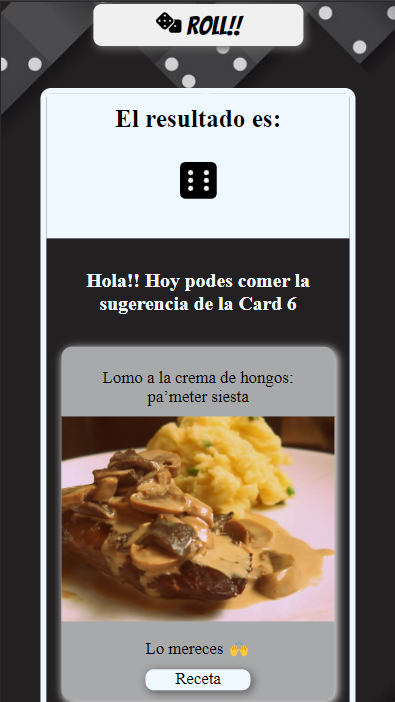

# Dados con React

Este proyecto fue realizado con la finalidad de practicar y dar mis primeros pasos con React, manejando los estilos con CSS puro.

Se trata de un juegos de dados para facilitar la elección del menú en aquellos días que no se nos ocurre qué cocinar... Bindandote también el link a la receta 🍝

Este juego de dados es propiedad de Trinidad Lari y está bajo su nombre. Todos los derechos reservados.
[App dados][https://github.com/TrinidadLari/Dados-React]